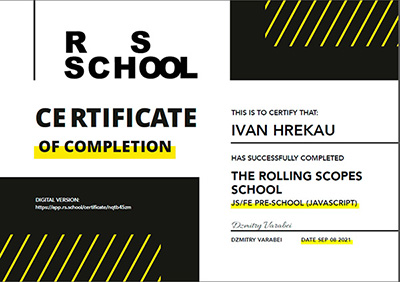
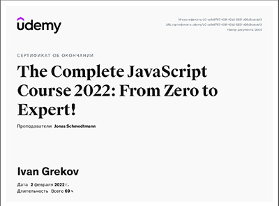
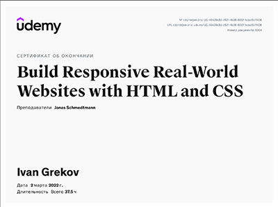

### Ivan Grekov

#### Personal information

Adress: Minsk, Belarus  
Email: ivan_grekov@yahoo.com  
Date of birth: 28th December 1993  
Nationality: Belarusian

---

#### Objective

I am a Junior Front End Developer with project management experience. I am passionate about good user experience and accessibility.

I’m looking for collaboration in non-profit / commercial projects.

---

#### Education

_First higher education_  
September 2010 – June 2015  
Belarusian State University of Transport (Gomel), mechanical department, engineer-electrician

_Second higher education_  
September 2017 – June 2019  
Belarusian State University (Minsk), Institute of Business and Technology Management, logistic-economist

_Self-education_

1.RSSchool course (Stage 0)

2.Udemy JavaScript course

3.Udemy HTML and CSS course

---

#### Key skills

- HTML
- CSS, SASS
- JavaScript
- Node.js
- Git
- Webpack
- MS Office

Languages: English (intermediate)

---
